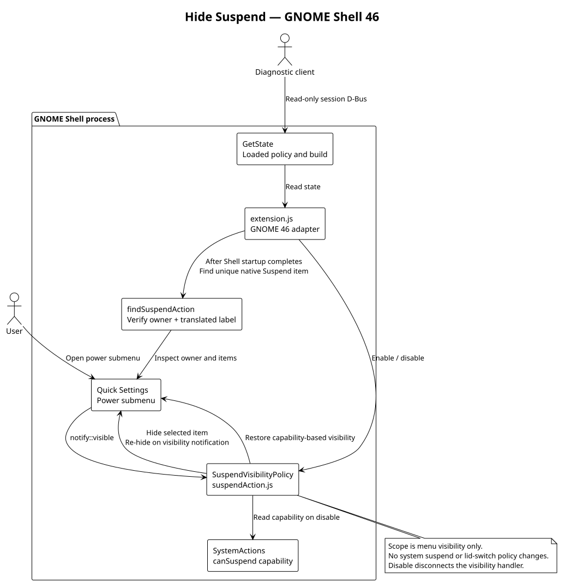

# Hide Suspend

A small **GNOME Shell 46** extension that removes **Suspend** from the power
submenu. It keeps that item hidden when GNOME refreshes power capabilities and
restores GNOME's normal Suspend visibility when disabled.


Native GNOME menu captured in a disposable session with synthetic capability
values; see the [visual guide](docs/visual-guide.md).


Read-only diagnostics from GNOME Shell 46; see the [visual guide](docs/visual-guide.md)
for capture details.

## What changes

Open Quick Settings, then its power submenu: Suspend is hidden while the extension
is enabled. Other power actions retain their normal behavior. This extension
changes menu visibility only: it does **not** disable system suspend, alter lid
switch behavior, or prevent other applications from requesting suspend.

At login, the extension waits for Shell startup to complete before attaching to
Quick Settings. Disabling it during startup cancels that pending attachment.

The adapter verifies the native `SystemActions` owner and finds a unique translated
Suspend label. Reordered menu entries are supported. If identity is missing or
ambiguous, enabling fails instead of hiding another action.

## Install and use

Requirements: GNOME Shell **46**, GNU Make, Node.js, `jq`, and ESLint. CI uses
Node 20 and the Ubuntu 24.04 distribution lint tools; there are no npm dependencies.

```sh
make check
make install
```

After GNOME discovers the extension, enable it:

```sh
gnome-extensions enable hide-suspend@sagecat.local
```

Installation copies files into your user extension directory; it does not enable
or reload the extension. On Wayland, discovery or replacing an imported module
can require a normal logout and login. Save your work first. When managed by
workspace-state, use its coordinated release staging and next-login activation.

To restore normal GNOME menu behavior:

```sh
gnome-extensions disable hide-suspend@sagecat.local
```

The restored visibility follows GNOME's current `canSuspend` capability, so
Suspend may remain hidden if GNOME itself says it is unavailable.

## Diagnose

Use the read-only endpoint while the extension is enabled:

```sh
gdbus call --session --dest org.gnome.Shell \
  --object-path /org/sagecat/HideSuspend \
  --method org.sagecat.HideSuspend.GetState
```

The returned D-Bus string contains JSON:

| Field | Meaning |
| --- | --- |
| `enabled` | A visibility policy was initialized successfully. |
| `build.uuid`, `build.version` | The loaded extension identity and metadata version. |
| `build.revision` | Import-time revision stamped by release staging. |
| `build.sourceIdentityKnown` | Whether the build has an exact stamped source identity. |

`development` means unstamped source identity. The endpoint reports the loaded
policy and build; it does not return a screenshot or independently verify the
current menu item visibility.

## Troubleshooting and limits

- **Object unavailable:** run `gnome-extensions info hide-suspend@sagecat.local`.
  The D-Bus object is exported only after a successful enable.
- **Unsupported owner / ambiguous label:** confirm GNOME 46. Another extension or
  a changed Shell implementation may have altered the menu. Check
  `journalctl --user -b` locally for the extension's error rather than relying on
  a fixed menu position.
- **Installed revision differs from the running revision:** use the `build` field
  to distinguish them, then load the intended release on the next normal login.
- **Suspend still works through another route:** expected; this is a menu-only
  extension, not a system power policy.

There is no settings panel. GNOME versions other than 46 are unsupported because
the adapter relies on private Shell menu APIs. Review journal output for private
machine information before sharing it.

## Design



The [PlantUML source](docs/architecture.puml) shows the narrow adapter and reversible
visibility policy. Re-render the diagram with:

```sh
plantuml -nometadata -tsvg docs/architecture.puml
```

Validate metadata, JavaScript, lint, and lifecycle behavior without a live Shell:

```sh
make check
```

## Checks and releases

The [CI workflow](.github/workflows/ci.yml) checks every change. Successful pushes
to the default branch publish a `build-<full-commit-SHA>` release with a source
archive, extension bundle, and SHA-256 checksums. See the
[release process](https://github.com/Sage-Cat/workspace-state/blob/main/docs/publication.md)
for artifact verification. Installing files and publishing a release do not
change an already running extension.

Enable the local privacy check in a fresh clone:

```sh
git config core.hooksPath .githooks
```

CI repeats this check before building or publishing.
