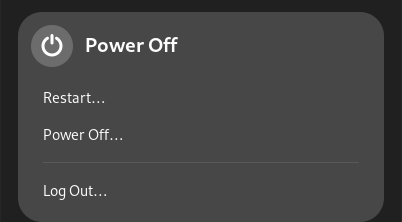
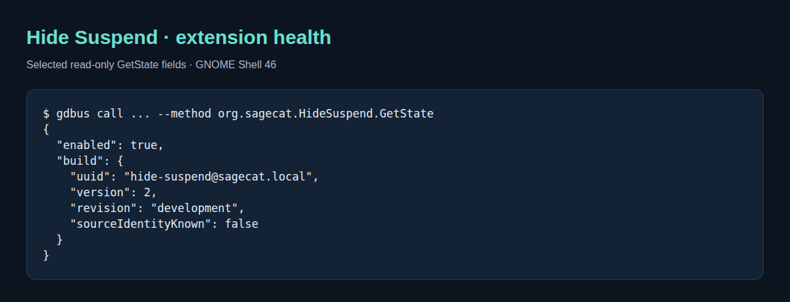

# Visual guide

## Native power menu



This is the native GNOME Shell 46.0 power submenu, captured with the current
extension in a disposable headless Wayland compositor. The fixture makes Suspend,
Restart, Power Off, and Log Out capabilities available using synthetic values.
The extension hides Suspend; the remaining native menu actions stay visible.
No power action is invoked. The submenu alone is captured, excluding desktop,
account, network, and other panel information. No image editing is applied.

Reproduce on a machine with GNOME Shell 46, Python 3, `gdbus`, `dbus-run-session`,
and `glib-compile-schemas`:

```sh
python3 docs/capture-native.py --run --output /tmp/power-menu-example
```

The harness copies the current extension and a documentation-only controller into
private temporary directories. It uses a separate session bus, memory settings,
and virtual monitor; it does not install into, enable extensions in, or reload the
active desktop. It terminates the disposable compositor after capture and has a
bounded timeout. Output contains `power-menu.png` and the actual read-only
`hide-suspend.json` response. The controller is never included in the extension's
installed files or bundle.

The headless Shell can still read system capabilities from the system bus. The
fixture overrides capability availability only inside its own Shell process for
a stable example; it does not change system power policy.

## Loaded-extension diagnostics



Read-only diagnostics from GNOME Shell 46. These values came from the current
source in the disposable compositor. The terminal-style image is rendered from
actual selected JSON fields, not a screenshot of a settings panel. An unstamped
`development` revision is expected for a source checkout.

Render diagnostics from the isolated capture:

```sh
python3 docs/capture-cli.py --from-json /tmp/power-menu-example/hide-suspend.json
```

Without `--from-json`, the script queries the currently enabled extension using
its read-only D-Bus endpoint. The renderer uses Python standard-library modules and an installed
`google-chrome` or `chromium` executable; it writes `docs/screenshots/diagnostics.png` and captures only an allowlist
of policy/build fields. Review generated images before publication.

## Architecture image

`architecture.svg` is generated from the editable `architecture.puml`:

```sh
plantuml -nometadata -tsvg docs/architecture.puml
```

Re-capture images when behavior or diagnostics change. Keep installed, running,
and source revisions distinct when comparing results.
